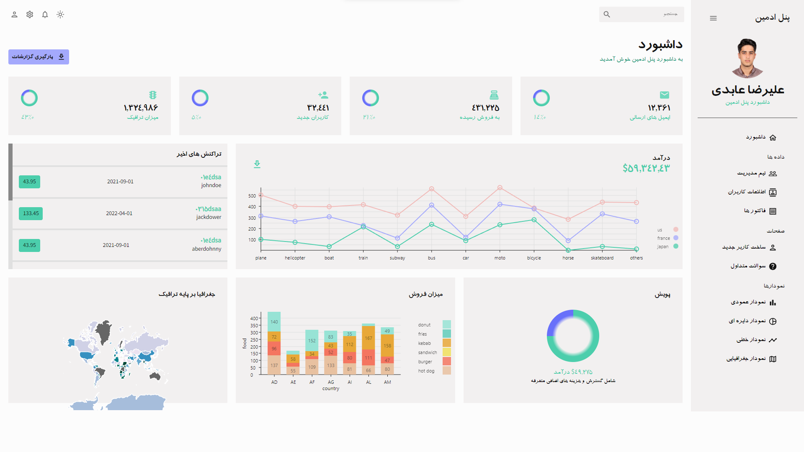

<h1 align='center' style="font-size:5rem"><b>داشبورد پنل ادمین</b></h1>

   
<h2 align='center'>
    شما به کمک این پنل ادمین میتوانید به همراه کتابخانه ری اکت وبسایت و پایگاه داده ی خود را مدیریت کنید.
</h2>

   

    <h2>حالت شب</h2>
    </img>

    <h2>حالت روز</h2>
    </img>

    

<h1 align='center'><b>قابلیت ها</b></h1>

<ul>
    <li> توانایی مدیریت داده های پایگاه داده</li>
    <li> توانایی نمایش دادن  داده ها به وسیله نمودار</li>
</ul>

    
<h1 align='center'><b>زبان ها و تکنولوژی های استفاده شده در این پروژه</h1>

    

<h1 align='center'><b>ابزارهای مورد نیاز</b></h1>

دانلود و نصب `NodeJS` از طریق وبسایت رسمی <a href="https://nodejs.org/">nodeJS.org</a>

    

<h1 align='center'><b>چگونه پروژه را اجرا کنیم؟</b></h1>

در مرحله اول کافیست فایل منبع پروژه را دانلود کنید.

 

بعد از آن محیط توسعه ی خود را باز کنید و در ادامه درون ترمینال آن دستور `npm i ~` را اجرا کنید.

 

در مرحله بعد دستور `npm run dev ~` را وارد کرده و تایید کنید.

تبریک، حالا میتوانید از این پنل ادمین برای پروژه های خود استفاده کنید.

